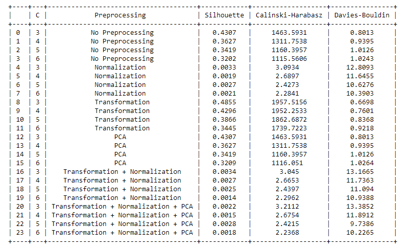
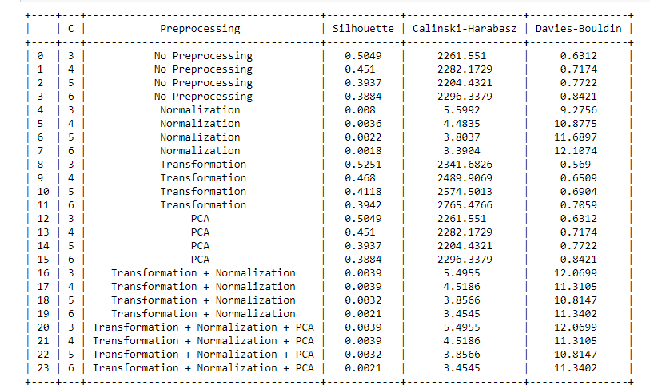

# Clustering-Ayun-102167007

# Clustering Assignment using PyCaret

This repository contains the implementation of different clustering algorithms on the Pokemon dataset using PyCaret. The goal is to explore the performance of clustering techniques with various pre-processing methods and evaluate them on different metrics.

## Dataset

The dataset used for this clustering assignment revolves around Pokemon, capturing information about various Pokemon species.

## Clustering Techniques

1. **K Means Clustering**
2. **Hierarchical Clustering**
3. **Birch clustring**

## Evaluation Parameters

The clustering techniques are evaluated based on the following parameters:

1. **Silhouette Score**
2. **Calinski-Harabasz Index**
3. **Davies-Bouldin Index**

## Pre-Processing Techniques

Various pre-processing techniques are applied to the data before clustering:

Various pre-processing techniques are applied to the data before clustering:

1. **No Preprocessing:** Using the raw data without any pre-processing.
2. **Normalization:** Scaling the features to a standard range.
3. **PCA (Principle Component Analysis):** Reducing dimensionality using PCA.
4. **Transform:** Applying a transformation to the data.
5. **Scale:** Scaling the data using standard scaling.
6. **Normalization + Transformation:** Combining normalization and transformation techniques.
7. **Normalization + Transformation + PCA:** Combining normalization, transformation, and PCA techniques.

## Repository Structure

- **`notebooks/`:** Jupyter notebooks containing the code for each clustering technique and pre-processing method.
- **`data/`:** Folder containing the Pokemon dataset.
- **`results/`:** Folder containing the results and visualizations.
- **`README.md`:** This file providing an overview of the assignment.

## Getting Started

1. Clone this repository:

    ```bash
    git clone https://github.com//clustering-assignment.git](https://github.com/Rohan1405/clustering-Rohan-102103108
    cd clustering-assignment
    ```


2. Explore the Jupyter notebooks  to understand the code and results.

3. Run the notebooks to reproduce the clustering experiments.

## Results

1. Kmeans Clustering
   
   </img>

2. Hierarchical clustering
  
   </img>

3. Birch clustering

    </img>
   
  
## Conclusion

This assignment explores the application of clustering algorithms on the Pokemon dataset with various pre-processing techniques. The results and visualizations provide insights into the performance of different clustering methods under different scenarios.

Feel free to reach out for any questions or further discussions!

